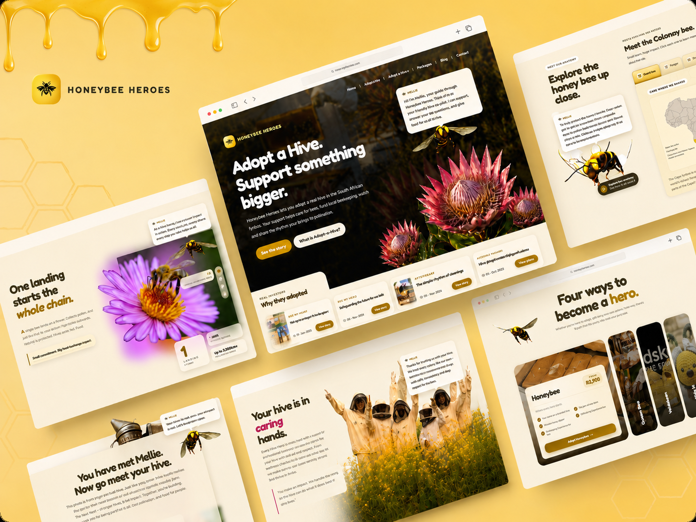
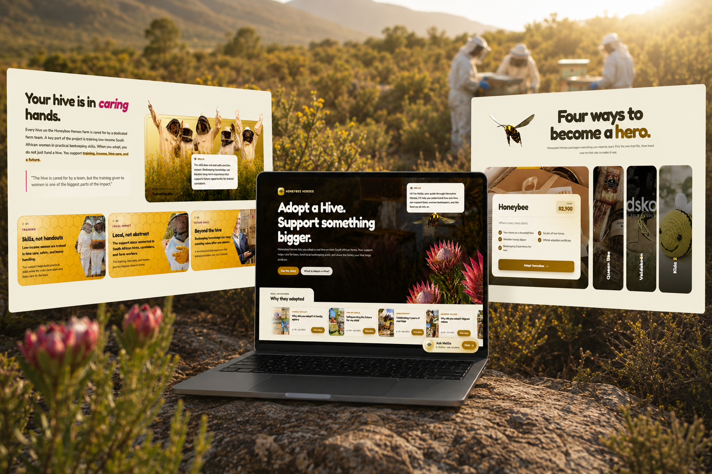
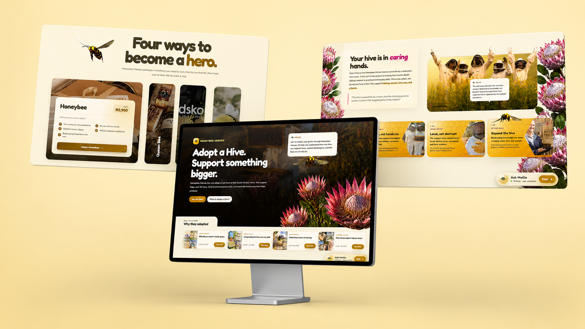

<!-- ════════════════════════════════════════════════════════════════
     HONEYBEE HEROES — README
     An interactive storytelling website using Mellie, a 3D honeybee guide,
     to explain adopt-a-hive impact, pollination, caretakers, and honey.
     ════════════════════════════════════════════════════════════════ -->

<a id="readme-top"></a>

<!-- ════════════════════════════════════════════════════════════════
     PROJECT SHIELDS
     ════════════════════════════════════════════════════════════════ -->

<div align="center">

[![React][React-shield]][React-url]
[![Vite][Vite-shield]][Vite-url]
[![JavaScript][JS-shield]][JS-url]
[![Three.js][Three-shield]][Three-url]
[![CSS3][CSS-shield]][CSS-url]
[![OpenAI][OpenAI-shield]][OpenAI-url]
[![License: MIT][License-shield]][License-url]

</div>

<!-- ════════════════════════════════════════════════════════════════
     PROJECT LOGO / HERO
     ════════════════════════════════════════════════════════════════ -->

<br />
<div align="center">

  <a href="#about-the-project">
    
  </a>

<h1 align="center">Honeybee Heroes</h1>

  <p align="center">
    <em>An interactive adopt-a-hive storytelling website guided by Mellie,<br>
    a 3D honeybee who helps visitors understand the real impact behind every hive.</em>
  </p>

  <!-- ▼▼▼ PRIMARY CALL TO ACTION — REPLACE URL WHEN LIVE ▼▼▼ -->
  <p align="center">
    <a href="https://honey-bee-heroes.web.app/">
      
    </a>
  </p>
  <!-- ▲▲▲ PRIMARY CALL TO ACTION ▲▲▲ -->

  <p align="center">
    <a href="https://drive.google.com/file/d/1bqNTLH0DW1IWl5Vr8EUi_sPRP0gEXDtJ/view?usp=drive_link">Watch the Full Walkthrough »</a>
  </p>
</div>

<br>

<!-- ════════════════════════════════════════════════════════════════
     TABLE OF CONTENTS
     ════════════════════════════════════════════════════════════════ -->

<details>
  <summary><strong>📖 Table of Contents</strong></summary>
  <ol>
    <li>
      <a href="#about-the-project">About The Project</a>
      <ul>
        <li><a href="#the-npo-context">The NPO Context</a></li>
        <li><a href="#project-goal">Project Goal</a></li>
        <li><a href="#what-makes-this-different">What Makes This Different</a></li>
        <li><a href="#built-with">Built With</a></li>
      </ul>
    </li>
    <li><a href="#video-walkthrough">Video Walkthrough</a></li>
    <li><a href="#showcase">Showcase</a></li>
    <li><a href="#the-seven-sections">The Seven Sections</a></li>
    <li>
      <a href="#architecture">Architecture</a>
      <ul>
        <li><a href="#project-structure">Project Structure</a></li>
        <li><a href="#component-system">Component System</a></li>
        <li><a href="#key-technical-patterns">Key Technical Patterns</a></li>
      </ul>
    </li>
    <li>
      <a href="#getting-started">Getting Started</a>
      <ul>
        <li><a href="#prerequisites">Prerequisites</a></li>
        <li><a href="#installation">Installation</a></li>
        <li><a href="#environment-variables">Environment Variables</a></li>
        <li><a href="#available-scripts">Available Scripts</a></li>
      </ul>
    </li>
    <li><a href="#deployment">Deployment</a></li>
    <li><a href="#media-and-content-credits">Media and Content Credits</a></li>
    <li><a href="#known-limitations">Known Limitations</a></li>
    <li><a href="#license">License</a></li>
    <li><a href="#creator">Creator</a></li>
    <li><a href="#acknowledgments">Acknowledgments</a></li>
  </ol>
</details>

<br>

<!-- ════════════════════════════════════════════════════════════════
     ABOUT THE PROJECT
     ════════════════════════════════════════════════════════════════ -->

## About The Project

[![Product Screenshot][product-screenshot]](https://honey-bee-heroes.web.app/)

> *"Adopting a hive is not only about receiving honey. It is about supporting bees, people, pollination, and the living systems that help food grow."*
> — **Mellie, the honeybee guide**

**Honeybee Heroes** is an interactive storytelling website that explains the deeper meaning behind the **Adopt-a-Hive** programme. Instead of presenting adoption as only a gift box or honey reward, the project turns the user journey into a guided experience where visitors learn how one hive connects to bee care, local farm work, pollination, biodiversity, education, and honey.

The experience is led by **Mellie**, a 3D honeybee character who moves through the site, reacts to hotspots, explains key moments, and helps visitors understand the human and environmental impact behind the hive.

### The NPO Context

Honeybee Heroes encourages people to adopt real hives and support bee-focused work on South African farms. The project highlights the impact chain behind the programme:

**Adopt a hive → support hive care → train and support people → protect bees → improve pollination → support food systems.**

A key part of the project is the training and income opportunity created for **low-income South African women**. At the same time, the site is careful not to imply that women are the only people caring for the bees. The hives are looked after by a wider farm team, including men, while the women’s training remains one of the strongest impact points of the initiative.

### Project Goal

The main goal is to shift the user’s understanding from:

> “I adopt a hive and get honey.”

into:

> “I adopt a hive and support a larger system of bees, caretakers, training, pollination, honey, and local impact.”

The website acts as a digital proxy for the NPO, using character-driven interaction, 3D animation, scroll-based storytelling, and clear visual sections to make the Adopt-a-Hive impact easier to understand.

### What Makes This Different

* 🐝 **Mellie as a 3D guide** — a moving honeybee character explains the story instead of static copy doing all the work
* 🌼 **Pollination-first storytelling** — the user learns why bees matter before being asked to adopt
* 🧭 **Guided section journey** — each section reveals one part of the hive impact chain
* 👥 **Human impact without oversimplifying** — the site highlights low-income women’s training while also acknowledging the wider farm team
* 🍯 **Adopt-a-Hive package clarity** — the adoption packages are explained visually and interactively
* 💬 **Interactive hotspots** — users can trigger Mellie’s explanations by hovering or clicking key elements
* 🎞️ **Hero video and visual mockups** — the site uses strong video-led presentation and mockup-ready sections for portfolio display

<p align="right">(<a href="#readme-top">▲ back to top</a>)</p>

### Built With

The stack was chosen to support movement, character interaction, visual storytelling, and a lightweight React build.

[![React][React-shield]][React-url]
[![Vite][Vite-shield]][Vite-url]
[![JavaScript][JS-shield]][JS-url]
[![Three.js][Three-shield]][Three-url]
[![CSS3][CSS-shield]][CSS-url]
[![HTML5][HTML-shield]][HTML-url]
[![OpenAI][OpenAI-shield]][OpenAI-url]


<p align="right">(<a href="#readme-top">▲ back to top</a>)</p>

<br>

<!-- ════════════════════════════════════════════════════════════════
     VIDEO WALKTHROUGH
     ════════════════════════════════════════════════════════════════ -->

## Video Walkthrough

> A short scroll-through showing the full Honeybee Heroes experience from the hero section to the adoption call-to-action.

<div align="center">

<!-- Replace this with your GitHub uploaded video attachment link after uploading your video to the README. -->


<br>

<a href="https://drive.google.com/file/d/1bqNTLH0DW1IWl5Vr8EUi_sPRP0gEXDtJ/view?usp=drive_link">▶ Watch the full walkthrough</a>

</div>

<p align="right">(<a href="#readme-top">▲ back to top</a>)</p>

<br>

<!-- ════════════════════════════════════════════════════════════════
     SHOWCASE / MOCKUPS
     ════════════════════════════════════════════════════════════════ -->

## Showcase

> Portfolio mockups showing the website in context.

<div align="center">

<a href="#about-the-project">
  
</a>

<sub><em>Hero-led desktop mockup showing Mellie and the Honeybee Heroes landing experience.</em></sub>

<br><br>

<a href="#about-the-project">
  
</a>

<sub><em>Secondary mockup showing the educational storytelling sections and adoption journey.</em></sub>

</div>

<p align="right">(<a href="#readme-top">▲ back to top</a>)</p>

<br>

<!-- ════════════════════════════════════════════════════════════════
     SITE SECTIONS
     ════════════════════════════════════════════════════════════════ -->

## The Seven Sections

The site is a single-page React experience split into seven core sections. Each section has its own component and CSS file so the project stays organised and easier to debug.

<table>
<tr>
<td width="50%" valign="top">

### 🐝 01 · Hero
*Adopt a Hive. Support something bigger.*

The opening section uses video, Honeybee Heroes branding, plant visuals, and a moving story strip to introduce the idea that hive adoption is more than a honey product.

![Hero Section][screenshot-hero]

</td>
<td width="50%" valign="top">

### 🌼 02 · Why Bees Matter
*One landing starts the whole chain.*

A sticky, scroll-driven pollination section explains how bees move from flower to field to farm to table. Mellie gives slide-specific narration as the user scrolls.

![Importance Section][screenshot-importance]

</td>
</tr>
<tr>
<td width="50%" valign="top">

### 🔍 03 · Meet Mellie
*Inspect the Cape honey bee.*

An interactive bee inspection section lets users rotate Mellie and explore tabs about the Cape honey bee, wings, pollination, body structure, and other bee facts.

![Bee Inspect Section][screenshot-bee-inspect]

</td>
<td width="50%" valign="top">

### 👥 04 · Caretakers
*Your hive is in caring hands.*

This section explains the people behind the hive. It highlights training for low-income women while also acknowledging the broader farm team who helps care for the bees.

![Caretakers Section][screenshot-caretakers]

</td>
</tr>
<tr>
<td width="50%" valign="top">

### 🍯 05 · Adoption Journey
*What happens after you adopt.*

A scroll-stack card system breaks the adoption journey into clear stages: naming the hive, receiving updates, getting honey, and visiting the farm.

![Journey Section][screenshot-journey]

</td>
<td width="50%" valign="top">

### 📦 06 · Adoption Packages
*Four ways to become a hero.*

An expanding package gallery introduces the Honeybee, Queen Bee, Veldskoen, and Kidz packages with visual panels, pricing, perks, and direct links.

![Adoption Section][screenshot-adoption]

</td>
</tr>
<tr>
<td width="50%" valign="top">

### 🚀 07 · CTA
*Now go meet your hive.*

The final section redirects users to the official Honeybee Heroes website for adoption, payments, and package selection.

![CTA Section][screenshot-cta]

</td>
<td width="50%" valign="top">

### 🧭 Footer
*Small hives. Real local impact.*

A compact footer gives visitors quick navigation, a final adoption link, and a clear close to the experience.

![Footer Section][screenshot-footer]

</td>
</tr>
</table>

<p align="right">(<a href="#readme-top">▲ back to top</a>)</p>

<br>

<!-- ════════════════════════════════════════════════════════════════
     ARCHITECTURE
     ════════════════════════════════════════════════════════════════ -->

## Architecture

### Project Structure

```txt
HONEYBEE-HEROES/
│
├── 📂 public/
│   ├── bee.glb                  # 3D bee model used by Three.js
│   ├── images/                  # Section images, mockups, package images, Mellie icon
│   │   ├── biodiversity/         # Pollination section images
│   │   ├── bee-inspect/          # Bee inspection images and map
│   │   ├── packages/             # Adoption package images
│   │   └── stories/              # Hero story-card images
│   └── videos/                  # Hero video and walkthrough assets
│
├── 📂 src/
│   ├── components/
│   │   ├── sections/
│   │   │   ├── HeroSection.jsx
│   │   │   ├── ImportanceSection.jsx
│   │   │   ├── BeeInspectSection.jsx
│   │   │   ├── CaretakersSection.jsx
│   │   │   ├── JourneySection.jsx
│   │   │   ├── AdoptionSection.jsx
│   │   │   └── CTASection.jsx
│   │   │
│   │   ├── BeeCanvas.jsx         # Three.js canvas layer
│   │   ├── SpeechBubble.jsx      # Mellie speech UI
│   │   ├── InteractionUI.jsx     # Ask Mellie interaction box
│   │   ├── Hotspot.jsx           # Reusable interactive trigger
│   │   ├── ScrollStack.jsx       # Journey card stack interaction
│   │   └── Footer.jsx
│   │
│   ├── context/
│   │   └── BeeContext.jsx        # Shared Mellie state and handlers
│   │
│   ├── data/
│   │   └── sections.js           # Section speech and bee positions
│   │
│   ├── hooks/
│   │   ├── useBeeEngine.js       # Three.js movement, speech events, interactions
│   │   └── useSectionReveal.js   # Optional scroll reveal animation hook
│   │
│   ├── styles/
│   │   ├── base.css
│   │   ├── tokens.css
│   │   ├── components/
│   │   └── sections/
│   │       ├── hero.css
│   │       ├── hero-stories.css
│   │       ├── importance.css
│   │       ├── bee-inspect.css
│   │       ├── caretakers.css
│   │       ├── journey.css
│   │       ├── adoption.css
│   │       └── cta.css
│   │
│   ├── App.jsx
│   ├── main.jsx
│   └── index.css
│
├── 📄 package.json
├── 📄 vite.config.js
├── 📄 eslint.config.js
└── 📄 README.md
```

<p align="right">(<a href="#readme-top">▲ back to top</a>)</p>

### Component System

The project is organised around **section ownership**. Each major visual area has its own component and CSS file. Shared interactive behaviour is handled through the Mellie system:

| System | Purpose |
|---|---|
| `BeeProvider` | Holds Mellie speech, interaction state, canvas ref, and shared handlers |
| `useBeeEngine` | Runs Three.js, moves Mellie, listens for section events, handles speech triggers |
| `BeeCanvas` | Renders the full-screen transparent 3D bee canvas |
| `SpeechBubble` | Follows Mellie and displays animated speech text |
| `Hotspot` | Lets any button/card trigger Mellie movement and speech |
| `InteractionUI` | Provides the Ask Mellie prompt interface |
| `sections.js` | Stores per-section Mellie position, speech, and interaction mode |

This keeps the storytelling flexible: a section can trigger Mellie without needing to directly control the Three.js scene.

### Key Technical Patterns

<details>
<summary><strong>🐝 3D Mellie Guide</strong></summary>

Mellie is loaded as a `.glb` model through Three.js and rendered over the website on a fixed transparent canvas. The bee moves toward section-specific positions, hotspot targets, and inspection states.

```js
const loader = new GLTFLoader();
loader.load('/bee.glb', (gltf) => {
  const mesh = gltf.scene;
  beeGroup.add(mesh);
});
```
</details>

<details>
<summary><strong>💬 Speech Bubble Following the Bee</strong></summary>

The speech bubble follows Mellie by projecting the bee’s 3D world position into screen coordinates. This keeps the interface feeling attached to the character instead of floating randomly.
</details>

<details>
<summary><strong>🌼 Sticky Pollination Story</strong></summary>

The Importance section uses a tall `400vh` container with a sticky stage. Scroll progress is converted into a scene index so the copy, image, stats, and Mellie speech update as the user moves.
</details>

<details>
<summary><strong>🔍 Interactive Bee Inspection</strong></summary>

The Bee Inspect section sends custom events to the bee engine. These events place Mellie into inspection mode, increase her scale, and allow manual rotation from the interface.
</details>

<details>
<summary><strong>🍯 ScrollStack Adoption Journey</strong></summary>

The Journey section uses stacked cards to make the adoption process feel like a guided sequence instead of a long list. Each card explains one stage of the adoption experience.
</details>

<details>
<summary><strong>📦 Expanding Package Gallery</strong></summary>

The Adoption section uses flex-based panels where the selected package expands and reveals details, perks, pricing, and a link to the official Honeybee Heroes adoption form.
</details>

<p align="right">(<a href="#readme-top">▲ back to top</a>)</p>

<br>

<!-- ════════════════════════════════════════════════════════════════
     GETTING STARTED
     ════════════════════════════════════════════════════════════════ -->

## Getting Started

To run the project locally, follow these steps.

### Prerequisites

You need **Node.js 18+** and **npm** installed.

```sh
node --version
npm --version
```

### Installation

1. **Clone the repository**
   ```sh
   git clone YOUR-REPOSITORY-LINK-HERE
   cd HONEYBEE-HEROES
   ```

2. **Install dependencies**
   ```sh
   npm install
   ```

3. **Run the dev server**
   ```sh
   npm run dev
   ```

4. **Open the local site**
   ```txt
   http://localhost:5173
   ```

### Environment Variables

Create a `.env` file in the project root if you are using the live AI and voice features.

```env
VITE_OPENAI_API_KEY=your_openai_key_here
```

> The visual website can still be viewed without these keys, but live AI answers will not work unless the API keys are added.

### Available Scripts

| Command | Description |
|---|---|
| `npm run dev` | Start the Vite development server |
| `npm run build` | Build the production version |
| `npm run preview` | Preview the production build locally |
| `npm run lint` | Run linting checks, if configured |

<p align="right">(<a href="#readme-top">▲ back to top</a>)</p>

<br>

<!-- ════════════════════════════════════════════════════════════════
     DEPLOYMENT
     ════════════════════════════════════════════════════════════════ -->

## Deployment

This project can be deployed as a static Vite site through platforms like **Netlify**, **Vercel**, or **Firebase Hosting**.

```sh
npm run build
```

The production files will be generated in:

```txt
dist/
```

For Netlify or Vercel, use:

| Setting | Value |
|---|---|
| Build command | `npm run build` |
| Publish directory | `dist` |

<p align="right">(<a href="#readme-top">▲ back to top</a>)</p>

<br>

<!-- ════════════════════════════════════════════════════════════════
     MEDIA AND CONTENT CREDITS
     ════════════════════════════════════════════════════════════════ -->

## Media and Content Credits

This project is built as an educational and portfolio-focused interactive website inspired by Honeybee Heroes and their Adopt-a-Hive programme.

| Asset / Content | Use |
|---|---|
| Honeybee Heroes branding | Referenced for the NPO identity and adoption story |
| Mellie bee model | Used as the interactive 3D guide |
| Beekeeper video | Used as the hero background video |
| Package images | Used to explain the adoption package options |
| Biodiversity images | Used in the pollination impact section |
| AI speech / voice tools | Used to prototype Mellie’s conversational guide behaviour |

> 

<p align="right">(<a href="#readme-top">▲ back to top</a>)</p>

<br>

<!-- ════════════════════════════════════════════════════════════════
     KNOWN LIMITATIONS
     ════════════════════════════════════════════════════════════════ -->

## Known Limitations

Being honest about what the project currently does and does not handle:

* **🖥️ Desktop-first interaction** — The 3D bee, sticky pollination section, and package gallery are strongest on desktop and laptop screens.
* **🔐 API keys are local-only** — OpenAI keys should never be committed to GitHub.
* **🔊 Browser audio restrictions** — Voice playback may require user interaction before audio can play.
* **📱 Mobile performance** — The 3D bee canvas and layered image sections may need additional optimisation for older phones.
* **🌐 Official adoption happens externally** — Payments, adoption forms, and deliveries are handled by Honeybee Heroes on their official website.

<p align="right">(<a href="#readme-top">▲ back to top</a>)</p>

<br>

<!-- ════════════════════════════════════════════════════════════════
     LICENSE
     ════════════════════════════════════════════════════════════════ -->

## License

Distributed under the **MIT License**. See `LICENSE` for full terms.

Project visuals, NPO references, images, videos, and 3D assets may have their own licenses. Replace placeholder credits with final asset attributions before public release.

<p align="right">(<a href="#readme-top">▲ back to top</a>)</p>

<br>

<!-- ════════════════════════════════════════════════════════════════
     CREATOR
     ════════════════════════════════════════════════════════════════ -->

## Creator

<div align="center">


<h3>Enzo De Vittorio</h3>

<p>
  <em>PGDip Creative Practice · Interactive Development</em><br />
  <strong>Open Window Institute</strong> · 2026<br />
  <sub>Student Number: 231244</sub>
</p>

<a href="https://github.com/EnzoDV08">
  
</a>

</div>

<p align="right">(<a href="#readme-top">▲ back to top</a>)</p>

<br>

<!-- ════════════════════════════════════════════════════════════════
     ACKNOWLEDGMENTS
     ════════════════════════════════════════════════════════════════ -->

## Acknowledgments

Thanks and credit to:

* **Honeybee Heroes** — for the Adopt-a-Hive inspiration and NPO context
* **Open Window Institute** — for the Creative Practice and Interactive Development project context
* **Three.js** — for making Mellie possible as a 3D web character
* **React and Vite** — for the fast component-based build environment
* **OpenAI** — for AI-response prototyping
* **Best-README-Template** — structure inspiration for this README style

<p align="right">(<a href="#readme-top">▲ back to top</a>)</p>

<br>

<div align="center">

---

<sub>*"Small hives. Real local impact."*</sub>

<sub>**Honeybee Heroes** · Enzo De Vittorio · 231244 · 2026</sub>

</div>

<!-- ════════════════════════════════════════════════════════════════
     MARKDOWN LINKS & IMAGES — REFERENCE STYLE
     ════════════════════════════════════════════════════════════════ -->

<!-- TECH STACK SHIELDS -->
[React-shield]: https://img.shields.io/badge/React-20232A?style=for-the-badge&logo=react&logoColor=61DAFB
[React-url]: https://react.dev
[Vite-shield]: https://img.shields.io/badge/Vite-646CFF?style=for-the-badge&logo=vite&logoColor=white
[Vite-url]: https://vitejs.dev
[JS-shield]: https://img.shields.io/badge/JavaScript-F7DF1E?style=for-the-badge&logo=javascript&logoColor=black
[JS-url]: https://developer.mozilla.org/en-US/docs/Web/JavaScript
[Three-shield]: https://img.shields.io/badge/Three.js-000000?style=for-the-badge&logo=threedotjs&logoColor=white
[Three-url]: https://threejs.org
[CSS-shield]: https://img.shields.io/badge/CSS3-1572B6?style=for-the-badge&logo=css3&logoColor=white
[CSS-url]: https://developer.mozilla.org/en-US/docs/Web/CSS
[HTML-shield]: https://img.shields.io/badge/HTML5-E34F26?style=for-the-badge&logo=html5&logoColor=white
[HTML-url]: https://developer.mozilla.org/en-US/docs/Web/HTML
[OpenAI-shield]: https://img.shields.io/badge/OpenAI-412991?style=for-the-badge&logo=openai&logoColor=white
[OpenAI-url]: https://openai.com


<!-- META SHIELDS -->
[License-shield]: https://img.shields.io/badge/License-MIT-blue.svg?style=for-the-badge
[License-url]: ./LICENSE
[GitHub-shield]: https://img.shields.io/badge/GitHub-181717?style=for-the-badge&logo=github&logoColor=white
[GitHub-url]: https://github.com/EnzoDV08

<!-- ════════════════════════════════════════════════════════════════
     IMAGE PATHS — REPLACE THESE WITH YOUR ACTUAL FILES
     Place all README images inside /docs/images/ in your repo
     ════════════════════════════════════════════════════════════════ -->

[product-screenshot]: docs/images/Mockup2.png

[screenshot-hero]: docs/images/Honeybee-Hero.png
[screenshot-importance]: docs/images/Honeybee-Importance.png
[screenshot-bee-inspect]: docs/images/Honeybee-Inspection.png
[screenshot-caretakers]: docs/images/Honeybee-Caretaker.png
[screenshot-journey]: docs/images/Honeybee-Journey-Card-Scroll.png
[screenshot-adoption]: docs/images/Honeybee-Adoption.png
[screenshot-cta]: docs/images/Honeybee-CTA.png
[screenshot-footer]: docs/images/Honeybee-Footer.png

